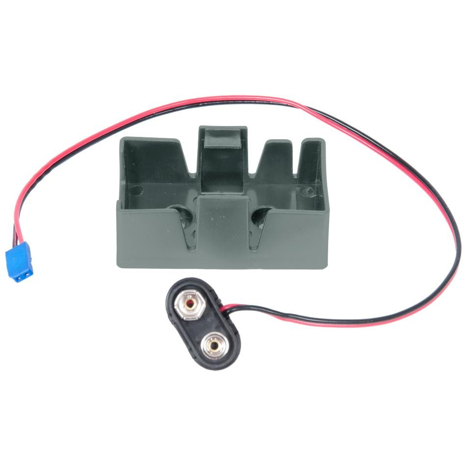

# Backup Battery
A backup battery is a 9V battery that can be connected to the cortex to keep it powered if the main battery fails. A competition robot should always have a backup battery as it prevents many connection related issues. 

## Mounting the Backup Battery
Screw the backup battery mount onto a structure that is close to the cortex. Connect a 9V battery to one end of the wire, and connect the other end into the slot at the front of the cortex labeled “Backup battery.” Slip the 9V battery into the mount. Done. Since very little power is being drawn from the backup battery, it is unlikely that you will need to replace it often. 

