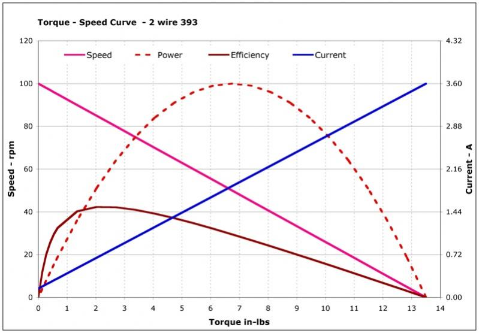

# Motors
*Motors power your robot*, and properly using them is essential to creating a robot that is fast and powerful. If motors aren’t used correctly, they will likely stall, click, or overheat which practically makes your robot unusable. Below will detail some specs, good practices, and ways to diagnose common motor problems. 
 
## Technical Specifications
Knowing the technical specifications of a motor is important to knowing its limits, and is also helpful for doing calculations. 
 
**Normal Motor:**  
Max RPM: 100   
Max Torque: 1.67 N-m  
 
**Overclocked Motor:**   
Max RPM: 160  
Max Torque: 1.0 N-m
 
**All Motors:**
Free current: 0.37A (how much current is normally being drawn)   
Stall current: 4.8A (how much current is being drawn when stalled)  
 
Below is a chart for various values. It is useful for calculating information such as how fast a motor will rotate under a certain load. 

 
 
## Best Practices for Using Motors
* Make sure motors are mounted tightly. Loose motors lose a lot of torque, which isn’t ideal. Tightening motors should be part of regular maintenance. 
* Label motors on your robot with whether they are overclocked or not. Incredibly helpful for calculations, wiring, and programming. 
* Make sure axles are collared in place if they are connected to a motor. If the axle falls out, the motor is useless. 
* Let motors cool down between matches and practice runs. They wear out over time and stall easier if they overheat. Don’t go wild with the robot unless the game really matters.
 
## Troubleshooting Common Problems
### Many motors on power expander or cortex will go out at once
This is most likely due to an excess current draw which trips a circuit breaker in either the cortex or the power expander. Ports 1-5 share a circuit breaker, ports 6-10 share another, and all the ports on the power expander are connected to another. Each circuit breaker trips after 4A of current draw, which means that when all motors are normally running (and therefore only drawing 0.37A of free current), the circuit breakers remain open. However, if a motor stalls for too long, it will draw 4.8A (stall current), and likely trip the circuit breaker, rendering all the other ports that share that circuit breaker useless temporarily. 
 
There is no silver bullet to fix this problem, but there are a variety of things to do that mitigate this risk. First, reduce the risk of motor stalling. Reduce friction, gear motors up for more torque, or add a slew rate control: anything to reduce motor stalling will help. Also, during games, try not to push the robot too hard, because that can also stall the motors. Next, rewire your robot strategically over the circuit breakers. Place motors that have a higher chance of stalling with less essential functions, and spread the load out over multiple circuit breakers. For example, if you know an intake motor regularly stalls, don’t place it on the same circuit breaker as the drive train.
 
### Motor clicks
If you hear a clicking sound from a motor, there are two possible issues: internal and external gear clicking. 
* **Internal clicking** results when there are chips on the gears inside the motor or little particles crushed within the motor teeth. Pop the motor casing open (on the front and back), and carefully inspect each gear. Clean off the teeth that have substantial pieces of gunk on them, and replace any chipped gears.
* **External clicking** is a bit more complicated. It can likely occur when too much torque is being applied to the motor, but can also result from chipped gears and other factors that don’t relate to the motor.
 
### Motor refuses to rotate
This is most likely due to gears locking up within the motor. Pop open the motor casing and make sure the gears rotate with each other. If they don’t, carefully clean and lubricate each gear so the gears continue to rotate. 
 
