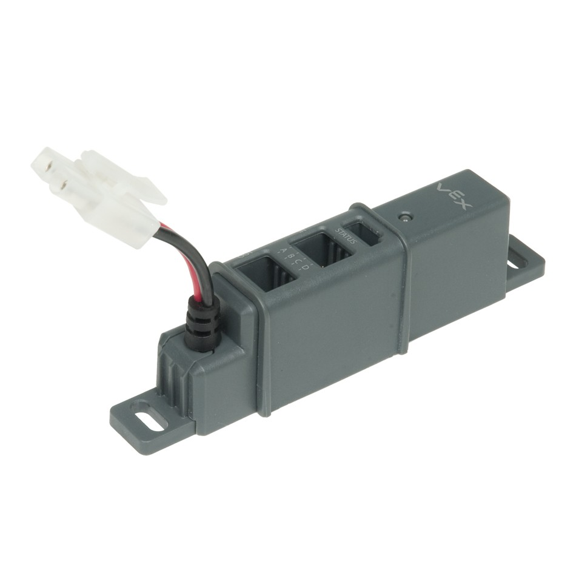

# Power Expander
The power expander allows a second battery to be added to the robot. Here is a guide to using it. 

## Wiring the Power Expander
The power expander allows four motors to be plugged into it. You’ll notice that there are two rows of four ports: one is for input, and the other is for output. Plug the motor controllers into the output side (the side that doesn’t have pins), and plug a 3 wire extension cable onto the input side. This cable should be plugged into the cortex at the desired port. For example, if you wanted to move a motor on port 6 to the power expander, plug it into any of the outputs. Then, plug the corresponding input pin into port 6 on the cortex. These motor will only run if there is a battery connected to the power expander. 

## Reading the Power Expander Value
If you want to read the value of the second battery, plug the “status” port into an analog sensor port on the cortex. Within RobotC, set it up as a potentiometer named “PWR”. You can then use the robotics library to access its value. You can read the specific documentation [here](https://github.com/PARobotics/Robotics-Library/wiki/Accessing-Battery-Values). 

