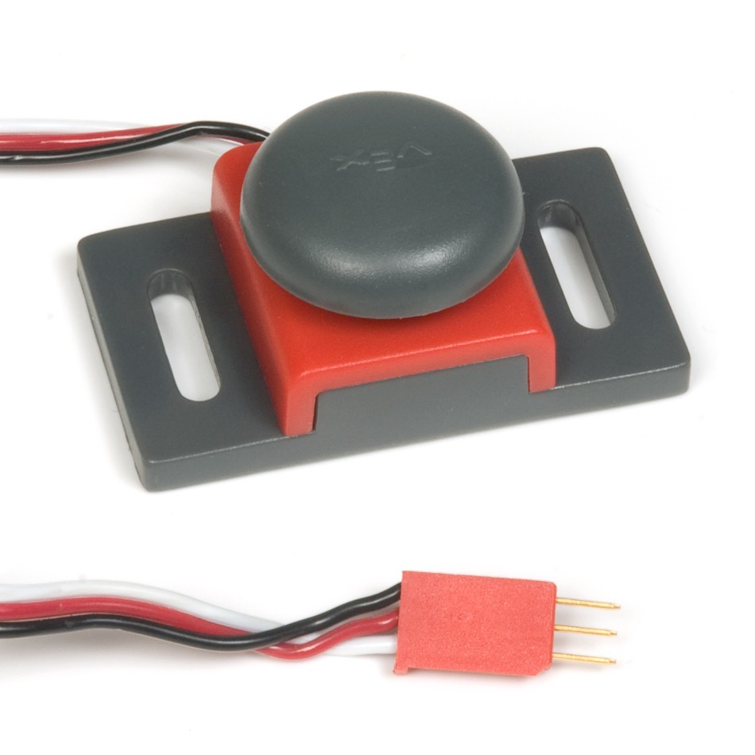
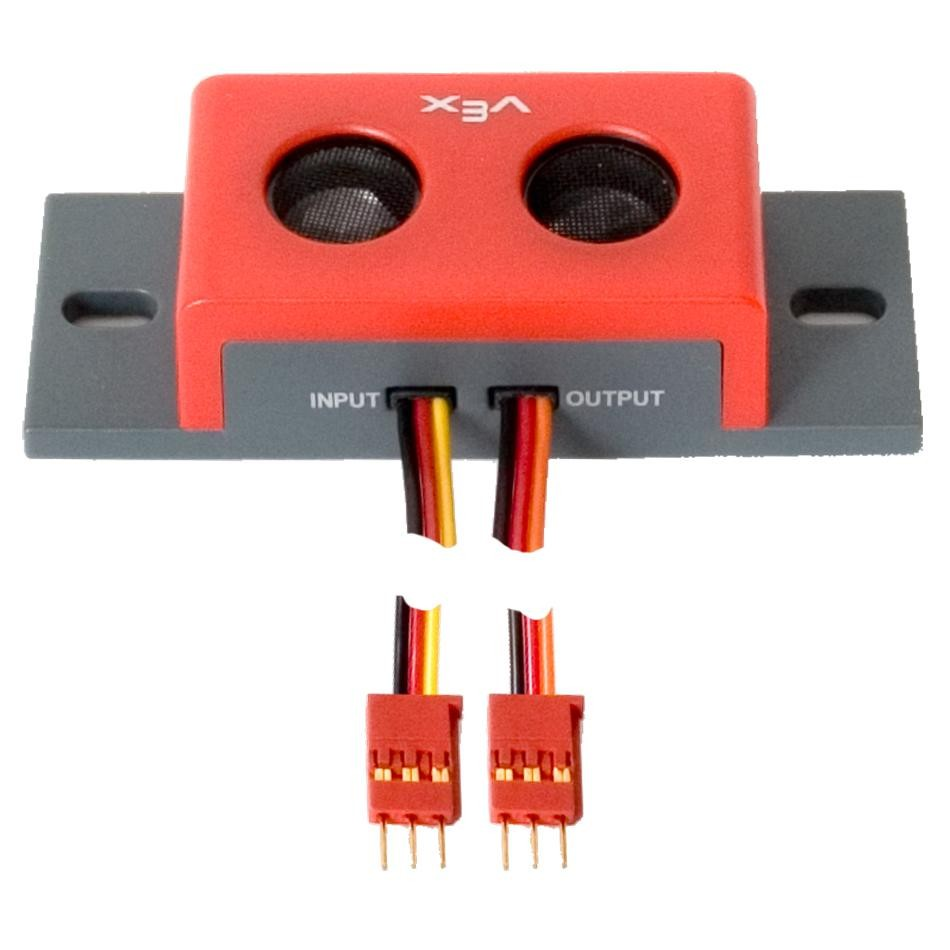
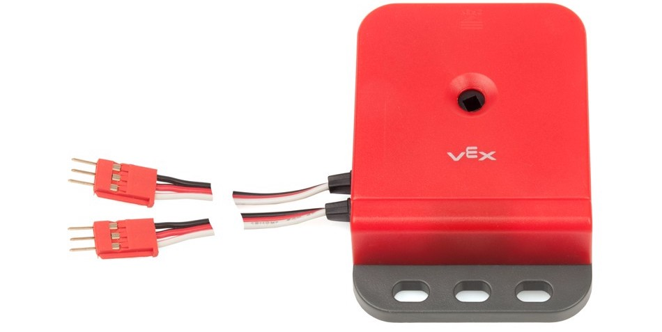
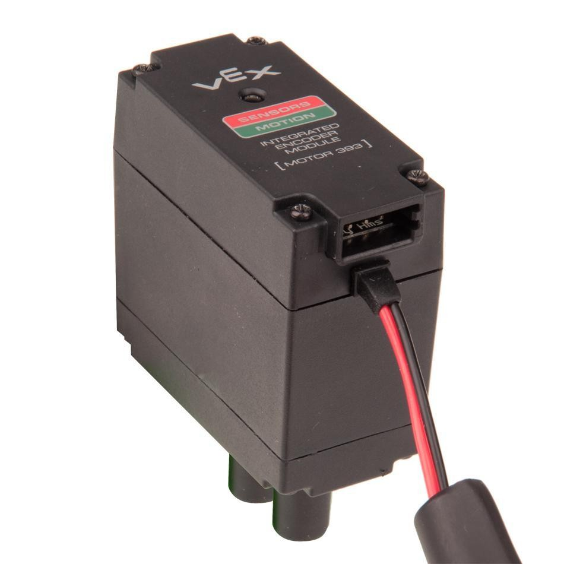
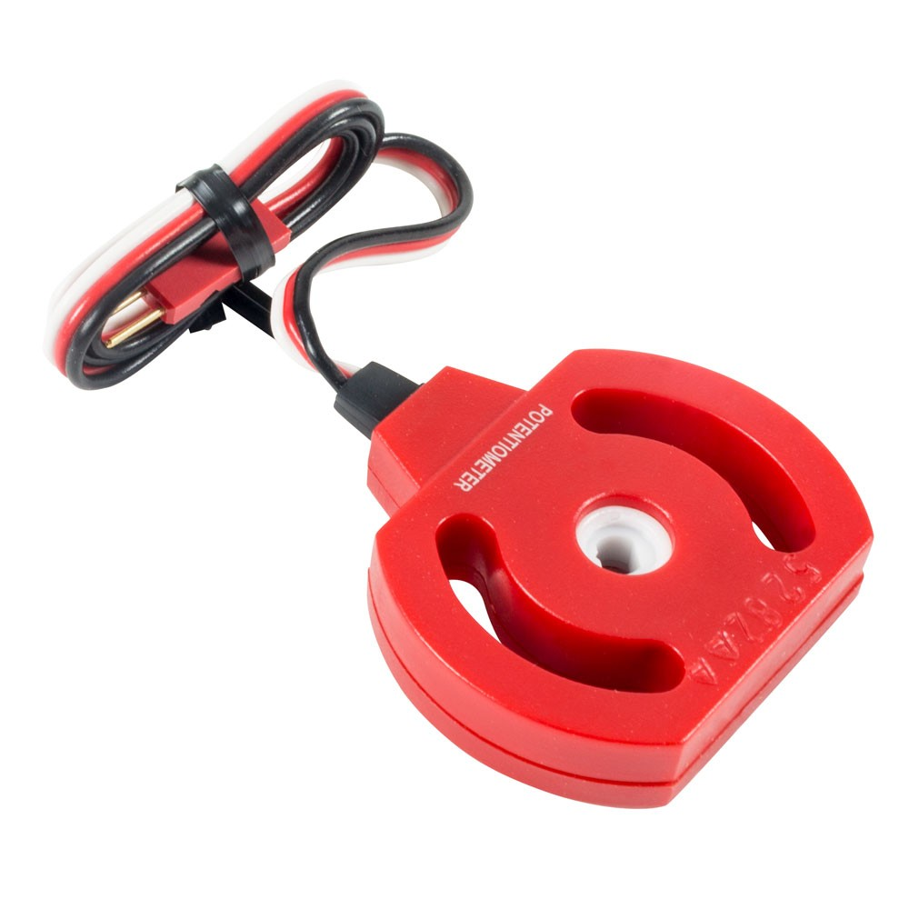
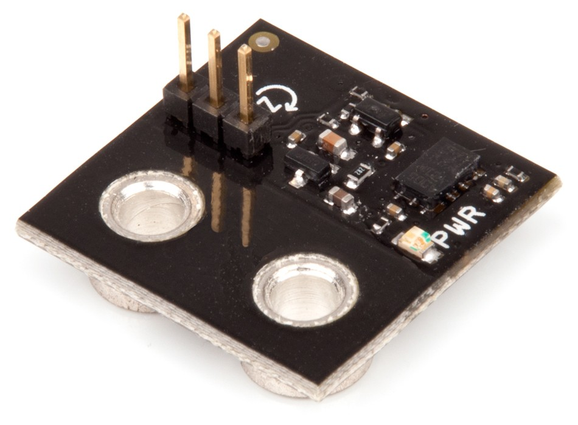
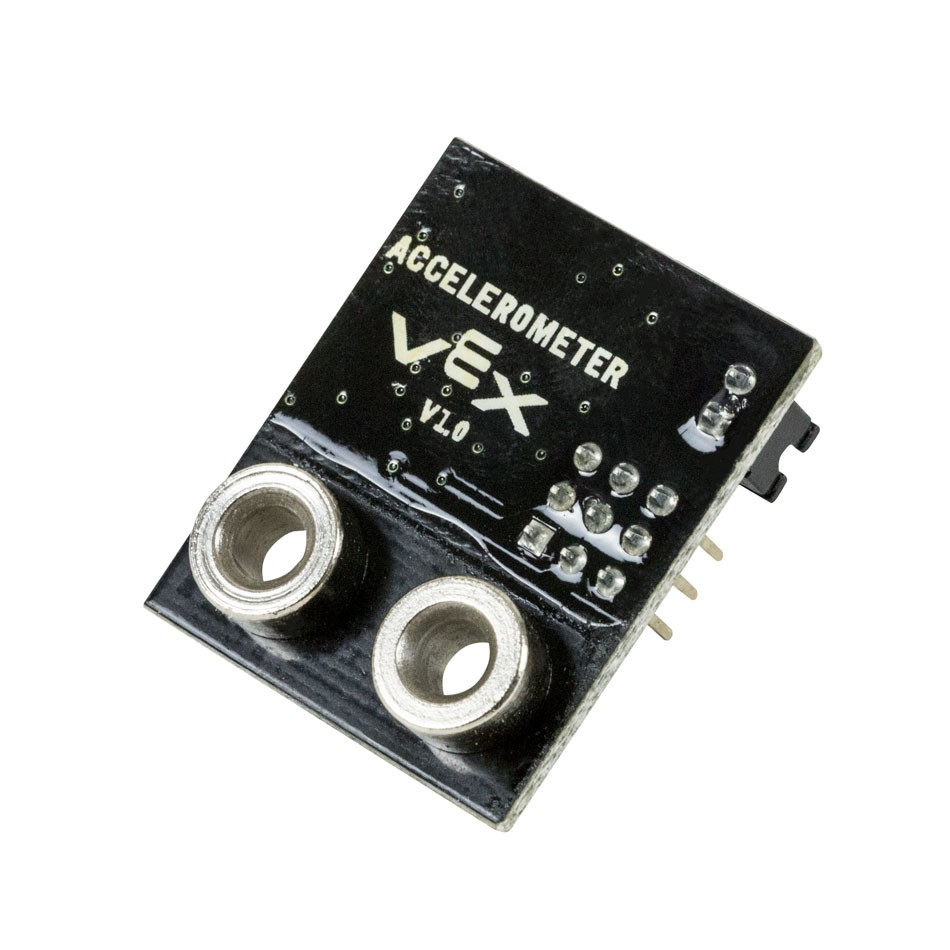
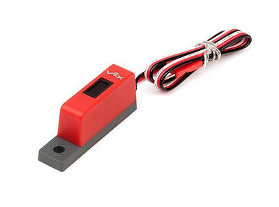

# Sensors
Using sensors is essential to programming effectively: they tell you vital details about the robot and its surroundings, allowing you to respond accordingly. Below is a guide describing the function and use cases of each sensor. 
 
## Button
Buttons are digital sensors which output either 0 or 1 depending on whether the button is pressed or not. They are useful as user input (i.e. having a button on the robot to press during pre autonomous), but can also be used to detect events such as collisions (if the button is compressed from hitting a wall). Keep in mind, buttons require a bit of force to push down fully.

  

## Limit Switch
Similar to buttons, limit switches are also digital sensors that output a 0 or 1 depending on whether the metal appendage is pushed all the way down or not. This makes it useful for detecting when a moving piece has reached its limit (hence the name). For example, the limit switch can be set up next to a rotating arm, and can be programmed so that when the arm compresses the limit switch, it stops. The metal arm is fragile though, so don’t apply too much load to it.

## Ultrasonic Sensor 
Ultrasonic sensors are digital sensors that can detect distance in terms of centimeters. They will output the distance to the first object within their field of view, so be sure to place the sensor with a good range of vision and don’t cover it’s line of sight with anything. It can be used for a variety of purposes, like detecting obstacles before hitting them. 

## Quadrature Encoder
Quadrature encoders, or shaft encoders are digital sensors that measure the rotation of an axle in terms of “ticks” (there are 360 ticks per revolution in a shaft encoder). They can be used to determine distance traveled, rotation speed, and a variety of other tasks by simply mounting them onto an axle. 

## Integrated Encoder
Integrated Encoders perform the same function as quadrature encoders, but there are some notable differences. First, they are mounted onto the back of a motor, making them significantly more compact, and are wired by daisy chaining them to the I2C port. Moreover, they measure the rotation of a specific motor, not an axle. Lastly, there are 392 ticks per revolution for an overclocked motor, and 627.2 ticks per revolution in a normal motor, which is slightly different from a shaft encoder. 

## Potentiometer
Potentiometers are analog sensors that, like encoders, can record the rotation of an axle. However, unlike encoders, potentiometers only measure one rotation (they will not record any more values past one full rotation), so they should be used only on joints that rotate less than 360 degrees, and not on something like a drive train. They also save state, which means that if you turn off a potentiometer, it will have the same value when it is turned back on. 

## Gyroscope
Gyroscopes are analog sensors that measure rotation. They are rather small and fragile, so should be mounted in a protected area. Also, they should be mounted somewhere sturdy to ensure accuracy of the sensor readings. 

## Accelerometer
Accelerometers are analog sensors that measure acceleration in all 3 axes (each axis is plugged into it’s own port). They are good for detecting collisions, or whether the robot is moving or not. Make sure that the accelerometer is mounted on a stable and protected location, otherwise it could receive inaccurate sensor readings. Also, movement of arms and joints on a robot could trigger false readings on the accelerometer.

## Line Tracker
Line trackers are analog sensors that detect the reflectively of a nearby surface using infrared. The most common usage for them is to follow the white lines placed on the field, as these lines reflect different amounts than the normal tiles. 

