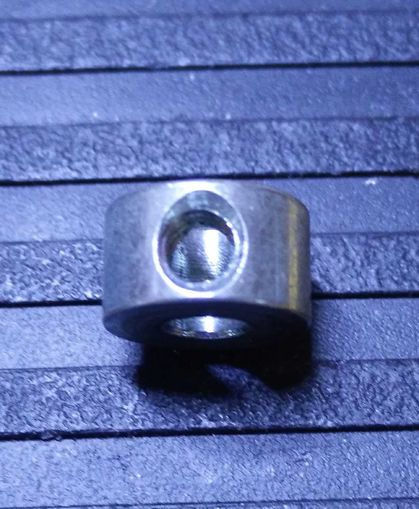
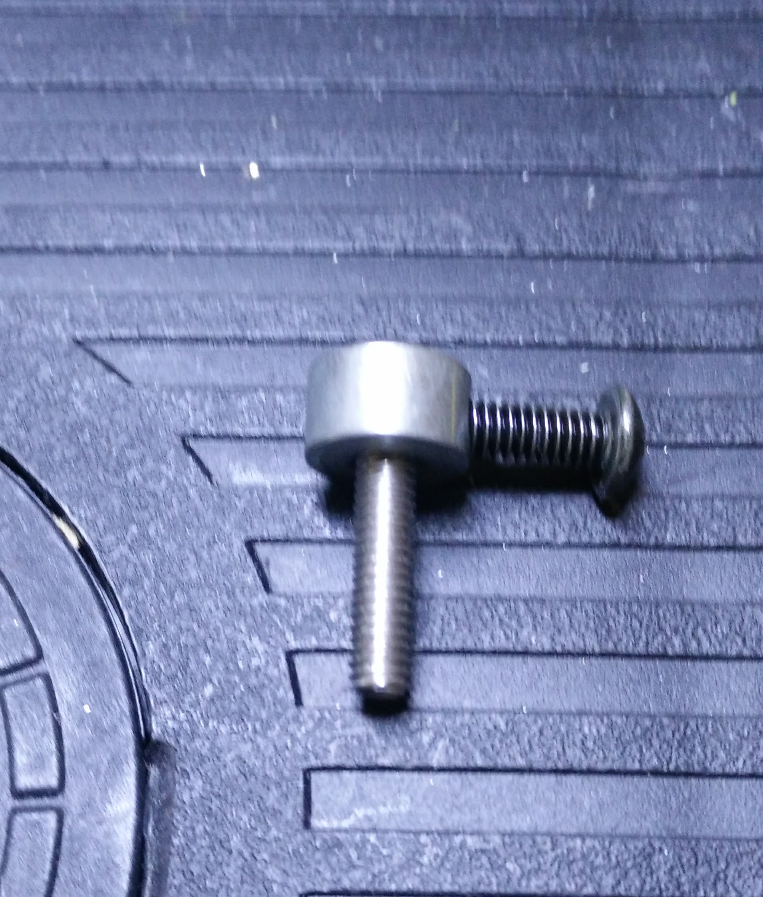

# Building Tricks
Below is a list of tricks we’ve discovered over the years that help with building robots. 

## Cutting Plexiglass
Plexiglass can be really hard to cut into the shapes you want: It usually comes in unwieldy, large sheets, and its flexibility makes it almost impossible to cut with a hacksaw. Here’s a good way to cut plexiglass: 

1) Take the piece of plexiglass you want to cut, and draw a line for each of the cuts. 

2) Using a ruler and X-Acto knife, repeatedly scrape away at each line. Flip the plexiglass over, and do the same thing. Keep scraping away until you think these lines are thin enough. 

3) Now, you can use scissors or just bend the plexiglass to break it apart. 

## A More Compact L-Bracket
If you want to mount something horizontally (meaning the screw holes face outward instead of up), you can always use an L-Bracket. However, these are too large for certain tasks, and if you just want to do something simple (like mounting a license plate), you can try the following trick: 

1) Take a shaft collar and remove the screw inside. 

2) One screw can be put through the shaft collar, and another one can be screwed in the original screw hole. These screws are perpendicular, so this setup can be used as a replacement for an L-Bracket. 

