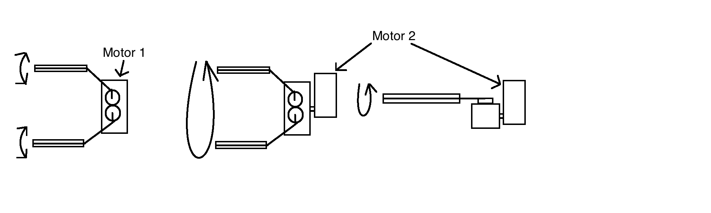

# Documentation in the Engineering Notebook
While it may seem boring and unimportant, documenting the building of a robot is vital. Not only can you look back and see what you have done, you can also improve on previous ideas. It also helps with troubleshooting, and the judges at competitions love to see these.

## How do I document a building step?
To document a building step, you need to act like you’re explaining the concept and design to a complete blithering idiot (given that this idiot knows the rules of VEX very well). Don’t take any knowledge for granted. The judges won’t know what you are talking about. Remember, they don’t usually talk to you. The only impression they have of the robot and the team is from the Engineering Notebook. That is why it is very important to explain everything clearly in detail.

## Wording
Try to stick to third person/passive perspective. The judges don’t need to hear about the people. They care about what’s going on with the robot. Say "this was added to the robot" instead of "we added this to the robot".

## Images
A picture speaks a thousand words. Make sure to take pictures of the robot frequently and put these pictures in the corresponding articles in the Engineering Notebook. When you are documenting a concept or design change, try to draw out what you are talking about, as it is sometimes hard to see changes on a full robot. Below is an example of a simple drawing that explains a rotating claw concept.

The program I use is Paintbrush. It’s very basic, but it serves our purpose. You can find the download link here: [download.cnet.com/Paintbrush/3000-2191_4-146998.html](http://download.cnet.com/Paintbrush/3000-2191_4-146998.html)

