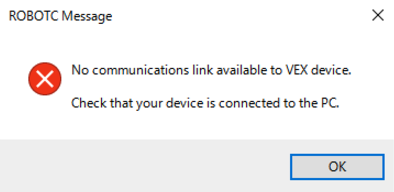
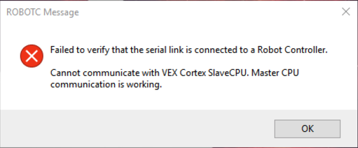
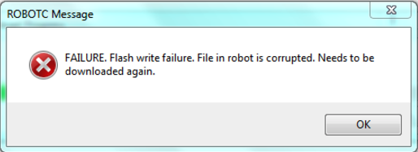

# Dealing with Flashing Errors
RobotC can occasionally be tricky when downloading (flashing) code to your robot. Here’s a list of common errors and how to solve them: 

## “No Communications Link Available”
If you get the error below, ROBOTC does not detect a robot connected to your computer. This error should not occur if you are using a wired connection (USB port to robot’s USB port), but if it does, just verify that everything is plugged in properly and the robot is power on. If you are using a wireless connection (USB port to joystick which is connected to robot), verify that the robot is connected to the joystick and that the joystick is plugged into the computer. If you still get this error, go to Windows Device Manager and check that you have the correct drivers for the programming kit. Driver downloads are available at [vexrobotics.com/vexedr/resources/firmware](https://www.vexrobotics.com/vexedr/resources/firmware). 

## “Failed to Verify that the Serial Link is Connected”
If you get the error below, there is most likely an issue with the robot’s firmware. Connect the robot to the computer using a wired connection (USB port to robot’s USB port), and open RobotC. In the menus, click on Robot > Download Firmware > Automatically Update VEX Cortex. Once this is done, power cycle the robot (unplug all cables, and turn it off and on), and try downloading the robot’s code again. If this still does not work, you will need to wipe the cortex. Download the “Firmware Upgrade Utility” from [https://www.vexrobotics.com/vexedr/resources/firmware](vexrobotics.com/vexedr/resources/firmware). Connect your robot to the computer using a wired connection, and in the program, click “Default Code” so it says “Default Code ON.” Then, press the new button which is labeled “Download Default.” Power cycle once you are done and retry downloading your code. 

## “Flash Write Failure”
This issue has to do with a faulty connection. Usually downloading again will do the trick. It can take up to 3-4 redownloads, so it may not always work after the first redownload. 

